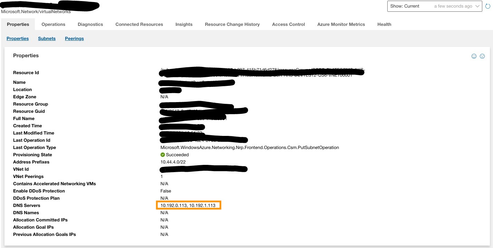

# DNS Policy and DNS Config

Reference: [DNS for Services and Pods](https://kubernetes.io/docs/concepts/services-networking/dns-pod-service/)

## Kubernetes cluster domain

The cluster domain name for AKS cluster is "cluster.local".

Each service has a FQDN  "[service name].[service namespace].svc.cluster.local.".

Each pod has a FQDN "[pod-ip-address].[pod namespace].pod.cluster.local."

## /etc/resolv.conf

Reference: [resolv.conf(5) — Linux manual page](https://man7.org/linux/man-pages/man5/resolv.conf.5.html)

Linux resolver configuration file. 
Important properties:
1. nameserver: 
   
   Name server IP address. Support up to 3 entries. If there are multiple servers, the resolver library queries them in the order listed.

2. search:

   Search list for host-name lookup. By default, the search list contains one entry, the local domain name of the VM. Pods with ClusterFirst DNS Policy will have multiple cluster domain related entries. See DNS Policy section below.
   Resolver will attempt to use each component of the search path in turn until a match is found, if the DNS query has fewer than ndots dots in them.

3. options: "ndots:n"

   Sets a threshold for the number of dots which must appear in a name given to resolver before an initial absolute query will be made.

## DNS servers
1. Azure DNS: 168.63.129.16 (shown as "Default" in the ASC)
2. Cluster DNS:
   By default, it is .10 address of the service IP range of the cluster. For example, 10.32.0.10 when service IP range is 10.32.0.0/16. Customer can also specify it during the cluster creation. 
3. External DNS servers:
   1. Google DNS: 8.8.8.8
   2. Cloudflare DNS: 1.1.1.1
4. Custom DNS server:
   
   Customer can create their own DNS servers and assocate them to their VNet. You can find them in the VNet in the ASC.
   

## DNS Policy

DNS policies can be set on a per-pod basis. Kubernetes supports the following pod-specific DNS policies. These policies are specified in the dnsPolicy field of a Pod Spec.

1. "**Default**": The Pod inherits the name resolution configuration from the node that the pods run on. 
2. "**ClusterFirst**": Any DNS query that does not match the configured cluster domain suffix, is forwarded to the upstream nameserver inherited from the node. Cluster administrators may have extra stub-domain and upstream DNS servers configured.
3. "**ClusterFirstWithHostNet**": For Pods running with hostNetwork, you should explicitly set its DNS policy "ClusterFirstWithHostNet".
4. "**None**": It allows a Pod to ignore DNS settings from the Kubernetes environment. All DNS settings are supposed to be provided using the dnsConfig field in the Pod Spec.

## Hands on Lab

Samples:
- [x] [Pod without DNS Policy](1-notspecified.yaml)
- [x] [Pod with "ClusterFirst" DNS Policy](2-clusterfirst.yaml)
- [x] [Pod with "Default" DNS Policy](3-default.yaml)
- [x] [HostNetwork Pod without DNS Policy](4-notspecified-hostnetwork.yaml)
- [x] [HostNetwork Pod with "ClusterFirstWithHostNet" DNS Policy](5-clusterfirstwithhostnet.yaml)
- [x] [Pod with "None" DNS Policy](6-none.yaml)
- [x] [Pod with "ClusterFirst" DNS Policy + DNS Config](7-dnsconfig-dnspolicy.yaml)


0. Create all test pods
   ```
   kubectl apply -f ./
   ```
   Result:
   ```
   pod/1-notspecified created
   pod/2-clusterfirst created
   pod/3-default created
   pod/4-notspecified-hostnetwork created
   pod/5-clusterfirstwithhostnetwork created
   pod/6-none created
   pod/7-dnsconfig-dnspolicy created
   ```

1. Check the content of /etc/resolv.conf from all pods
- [Pod without DNS Policy](1-notspecified.yaml)
   ```
   kubectl exec 1-notspecified -- cat /etc/resolv.conf
   ```
   Result:
   ```
   search default.svc.cluster.local svc.cluster.local cluster.local psa1ciucc1putoh3dr0jjgdiwg.xx.internal.cloudapp.net
   nameserver 10.0.0.10
   options ndots:5
   ```
- [Pod with "ClusterFirst" DNS Policy](2-clusterfirst.yaml)
   ```
   kubectl exec 2-clusterfirst -- cat /etc/resolv.conf
   ```
   Result:
   ```
   search default.svc.cluster.local svc.cluster.local cluster.local psa1ciucc1putoh3dr0jjgdiwg.xx.internal.cloudapp.net
   nameserver 10.0.0.10
   options ndots:5
   ```
- [Pod with "Default" DNS Policy](3-default.yaml)
   ```
   kubectl exec 3-default -- cat /etc/resolv.conf
   ```
   Result:
   ```
   search psa1ciucc1putoh3dr0jjgdiwg.xx.internal.cloudapp.net
   nameserver 168.63.129.16
   ```
- [HostNetwork Pod without DNS Policy](4-notspecified-hostnetwork.yaml)
   ```
   kubectl exec 4-notspecified-hostnetwork -- cat /etc/resolv.conf
   ```
   Result:
   ```
   search psa1ciucc1putoh3dr0jjgdiwg.xx.internal.cloudapp.net
   nameserver 168.63.129.16
   ```
- [HostNetwork Pod with "ClusterFirstWithHostNet" DNS Policy](5-clusterfirstwithhostnet.yaml)
   ```
   kubectl exec 5-clusterfirstwithhostnet -- cat /etc/resolv.conf
   ```
   Result:
   ```
   search default.svc.cluster.local svc.cluster.local cluster.local psa1ciucc1putoh3dr0jjgdiwg.xx.internal.cloudapp.net
   nameserver 10.0.0.10
   options ndots:5
   ```
- [Pod with "None" DNS Policy](6-none.yaml)
   ```
   kubectl exec 6-none -- cat /etc/resolv.conf
   ```
   Result:
   ```
   nameserver 1.1.1.1
   ```
- [Pod with "ClusterFirst" DNS Policy + DNS Config](7-dnsconfig-dnspolicy.yaml)
   ```
   kubectl exec 7-dnsconfig-dnspolicy -- cat /etc/resolv.conf
   ```
   Result:
   ```
   search default.svc.cluster.local svc.cluster.local cluster.local psa1ciucc1putoh3dr0jjgdiwg.xx.internal.cloudapp.net my.dns.search.suffix
   nameserver 10.0.0.10
   nameserver 1.1.1.1
   options ndots:5 single-request-reopen
   ```
